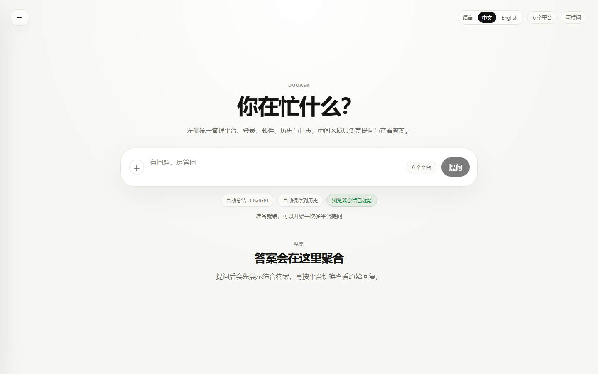
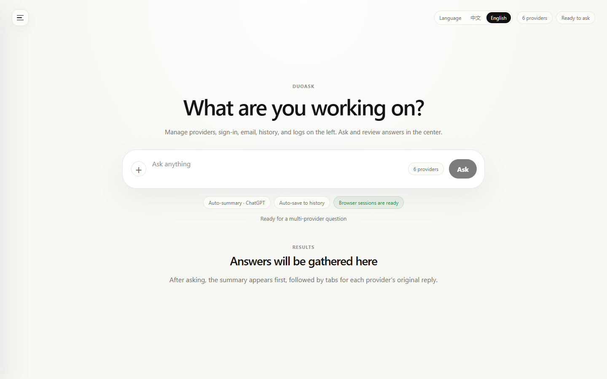

# 多问 DuoAsk

[](https://github.com/gangke3/polyanswer-hub/actions/workflows/ci.yml)
[](LICENSE)


DuoAsk is a local-first Windows desktop app for asking one question across ChatGPT, Claude, Gemini, Kimi, Doubao, and Grok, then comparing the answers and synthesizing a final response locally.

多问是一个本地优先的 Windows 桌面应用：一次输入问题，同时发送给多个 AI 平台，对比原始回答，并在本地生成综合结论。界面支持中文和 English，可在右上角即时切换。





## Highlights

- **One prompt, many providers**: send the same question to multiple AI assistants.
- **Bilingual interface**: switch between 中文 and English from the main toolbar.
- **Side-by-side answers**: keep raw provider answers visible for comparison.
- **Synthesis workflow**: generate a clearer final answer from the collected results.
- **Local-first sessions**: reuse browser login state stored on your own machine.
- **Local history and export**: save, reopen, delete, and export previous tasks.
- **Scriptable local API**: call DuoAsk from other tools through `127.0.0.1`.

## 功能概览

- **一次提问，多平台回答**：同一个问题可同时发送到多个 AI 平台。
- **中英双语界面**：右上角提供语言切换，偏好只保存在本机。
- **原始回答对比**：按平台切换查看每一份原始回复。
- **综合答案**：可使用规则综合，也可选定平台自动总结全部回答。
- **本地会话复用**：登录流程在可见浏览器中完成，会话数据留在本机。
- **本地历史与导出**：可保存、查看、删除并导出任务记录。
- **本地 HTTP API**：默认监听 `127.0.0.1:3719`，方便与本机工具集成。

## Quick Start

Requirements:

- Windows
- Node.js 22 or newer
- npm 10 or newer
- Local Chrome or Edge installation for browser automation

Install and run in development:

```bash
npm install
npm run dev
```

Build and start the compiled app:

```bash
npm run build
npm run start
```

Create a Windows portable release zip:

```bash
npm run package:win:portable
```

The portable package is written to `release/` and can be attached to a GitHub Release. Installer packaging is still planned.

Windows helper script:

```powershell
.\启动多问.cmd
```

## 快速开始

开发环境运行：

```bash
npm install
npm run dev
```

构建后运行：

```bash
npm run build
npm run start
```

生成 Windows 便携版压缩包：

```bash
npm run package:win:portable
```

发布文件会生成到 `release/` 目录。该目录被 `.gitignore` 忽略，不会随源码提交到 GitHub。

## Current Status

DuoAsk is an MVP-stage desktop app. The main app shell, provider orchestration, browser-session reuse, local API, history, export helpers, bilingual UI, and real provider adapters are in place.

| Area | Status |
| --- | --- |
| Desktop app | Working Electron + React app |
| Interface languages | 中文 and English |
| Local API | Working on `127.0.0.1:3719` |
| Provider automation | Browser-based, user-assisted login |
| Local history | JSON-backed task history today; SQLite schema exists |
| Synthesis | Rule-based synthesis plus optional provider summary |
| Packaging | Windows portable zip works; installer packaging is planned |

Provider web UIs change frequently, so provider adapters should be treated as maintained integrations rather than permanent contracts.

## Provider Support

| Provider | Mode | Notes |
| --- | --- | --- |
| ChatGPT | Browser automation | Real adapter implemented; login may require manual verification |
| Claude | Browser automation | Experimental adapter |
| Gemini | Browser automation | Experimental adapter; Google account state can vary |
| Kimi | Browser automation | Experimental adapter |
| Doubao | Browser automation | Experimental adapter; may require manual verification |
| Grok | Browser automation | Experimental adapter |

DuoAsk does not bypass provider login, CAPTCHA, verification pages, usage limits, or provider terms. The intended flow is manual login in a visible browser, then local session reuse.

## Local API

After the desktop app starts, it opens a local HTTP API for tools running on the same machine.

- health check: `GET /api/health`
- provider list: `GET /api/providers`
- ask question: `POST /api/ask`
- open login pages: `POST /api/login/open`

Example request on Windows:

```bash
curl -X POST http://127.0.0.1:3719/api/ask ^
  -H "Content-Type: application/json" ^
  -d "{\"question\":\"Summarize what this code does\"}"
```

By default:

- if `providerIds` is omitted or empty, all supported providers are used
- `autoSynthesize` is enabled
- `autoSave` is enabled
- `autoSummarize` is optional and can use a selected provider to summarize all answers

Optional environment variables:

- `DUOASK_API_HOST` changes the bind address
- `DUOASK_API_PORT` changes the port
- `DUOASK_API_TOKEN` requires `Authorization: Bearer <token>`
- `DUOASK_SMTP_USER` sets the default SMTP user
- `DUOASK_SMTP_PASS` sets the default SMTP password

Legacy `POLYANSWER_API_*` variable names are still accepted for compatibility.

## Privacy And Safety

- Provider login happens in a visible browser flow controlled by the user.
- Provider sessions are stored locally under ignored `data/` folders and must not be committed.
- Local history, app settings, browser snapshots, logs, SMTP credentials, and API tokens are local user data.
- README screenshots are generated with a mock local API and do not include real prompts, provider answers, accounts, cookies, or chat history.
- The local API binds to `127.0.0.1` by default. Set `DUOASK_API_TOKEN` if another local tool needs authenticated access.
- If a secret was ever committed or shared, rotate it before publishing or distributing the repository.

## Workspace Layout

```text
.
|-- apps/
|   `-- desktop/          # Electron main process, preload, and React renderer
|-- packages/
|   |-- browser-runner/   # Playwright browser/session helpers
|   |-- db/               # database schema and repositories
|   |-- export/           # Markdown, TXT, and PDF exporters
|   |-- logger/           # local logging helpers
|   |-- orchestrator/     # task coordination and provider workers
|   |-- providers/        # provider adapters
|   |-- shared/           # shared types, constants, and utilities
|   `-- synthesizer/      # answer synthesis logic
|-- docs/                 # product, architecture, and setup notes
|-- package.json          # root workspace scripts
`-- tsconfig.base.json    # shared TypeScript config
```

## Development

Useful checks:

```bash
npm run check
npm run release:check
npm run package:win:portable
```

Individual checks:

```bash
npm run typecheck
npm run lint
npm run build
npm audit --omit=dev --registry=https://registry.npmjs.org
```

`npm run lint` uses ESLint with a conservative flat config. The rule set is intentionally light for the MVP and can be tightened as the codebase stabilizes.

## Contributing

Contributions are welcome, especially provider-selector fixes, export improvements, smoke tests, packaging work, localization improvements, and documentation updates.

Before opening a pull request:

- run `npm run check`
- avoid committing browser profiles, cookies, prompt history, snapshots, tokens, SMTP credentials, or `.env` files
- note which provider account state you tested if changing provider automation
- update README or docs when user-facing behavior changes

See [CONTRIBUTING.md](CONTRIBUTING.md), [CODE_OF_CONDUCT.md](CODE_OF_CONDUCT.md), [SUPPORT.md](SUPPORT.md), and [SECURITY.md](SECURITY.md).

## Roadmap

- Package the desktop app as a normal Windows installer.
- Keep README screenshots and GitHub social preview image up to date.
- Replace JSON history persistence with the SQLite repository layer.
- Add focused smoke tests for orchestration and provider adapters.
- Add stricter formatting and test automation.
- Harden provider selectors and completion detection.
- Improve synthesis beyond the rule-based baseline.
- Split large renderer files into smaller view and component modules.
- Expand localization coverage as new UI surfaces are added.

## Documentation

- [Product requirements](docs/PRD.md)
- [Architecture overview](docs/ARCHITECTURE.md)
- [Setup notes](docs/SETUP.md)
- [Provider strategy](docs/PROVIDERS.md)
- [Implementation status](docs/IMPLEMENTATION_STATUS.md)
- [Delivery plan](docs/DELIVERY_PLAN.md)
- [Roadmap](docs/ROADMAP.md)
- [Release preparation checklist](docs/PREPARE_RELEASE.md)
- [Public launch plan](docs/PUBLIC_LAUNCH_PLAN.md)
- [Changelog](CHANGELOG.md)

## License

MIT. See [LICENSE](LICENSE).
