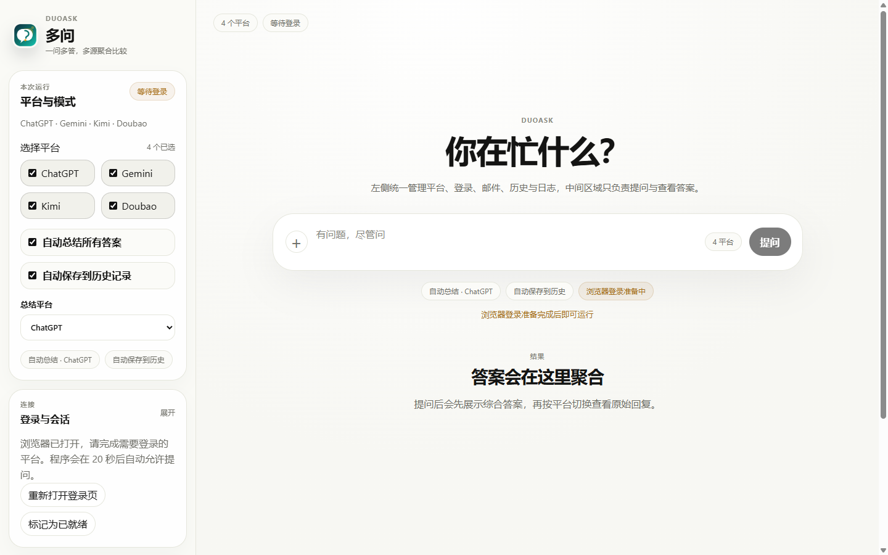

# 多问 DuoAsk

Ask ChatGPT, Claude, Gemini, Kimi, Doubao, and Grok at once, compare their answers locally, and synthesize a final response.

多问 DuoAsk is a local-first Windows desktop app for people who use several AI assistants and want one clean workspace for comparison, synthesis, history, and export.



## Why It Exists

Different AI models often disagree, omit details, or shine at different parts of the same question. DuoAsk reduces tab switching and makes multi-model comparison practical:

- ask one question across multiple providers
- keep raw provider answers side by side
- synthesize a clearer final answer
- save local task history for review
- expose a local HTTP API for scripts and tools
- keep provider sessions and history on your machine

## Status

DuoAsk is an MVP-stage desktop app. The main app shell, provider orchestration, browser-session reuse, local API, history, export helpers, and real provider adapters are in place, but provider web UIs change frequently and should be treated as maintained integrations.

| Area | Status |
| --- | --- |
| Desktop app | Working Electron + React app |
| Local API | Working on `127.0.0.1:3719` |
| Provider automation | Browser-based, user-assisted login |
| Local history | JSON-backed task history today; SQLite schema exists |
| Synthesis | Rule-based synthesis plus optional provider summary |
| Packaging | Source build works; installer/release packaging still planned |

## Providers

| Provider | Mode | Notes |
| --- | --- | --- |
| ChatGPT | Browser automation | Real adapter implemented; login may require manual verification |
| Claude | Browser automation | Experimental adapter |
| Gemini | Browser automation | Experimental adapter; Google account state can vary |
| Kimi | Browser automation | Experimental adapter |
| Doubao | Browser automation | Experimental adapter; may require manual verification |
| Grok | Browser automation | Experimental adapter |

DuoAsk does not bypass provider login, CAPTCHA, verification pages, usage limits, or provider terms. The intended flow is manual login in a visible browser, then local session reuse.

## Features

- **Multi-provider prompting**: submit the same prompt to selected AI providers.
- **Visible login flow**: open provider pages and let the user log in manually.
- **Session persistence**: reuse a local browser profile for later tasks.
- **Parallel orchestration**: run providers concurrently and collect each result.
- **Result comparison**: switch between synthesis and raw provider answers.
- **Local history**: save, reopen, delete, and export previous tasks.
- **Local API**: call DuoAsk from external scripts via HTTP.
- **Email delivery**: optionally send task results through a user-configured SMTP server.

## Screenshots


## Tech Stack

- Electron
- React
- TypeScript
- Vite
- npm workspaces
- Playwright
- SQLite schema design

## Getting Started

### Requirements

- Windows
- Node.js 22 or newer
- npm 10 or newer
- A local Chrome or Edge installation for browser automation

### Install

```bash
npm install
```

### Run In Development

```bash
npm run dev
```

### Build

```bash
npm run build
```

### Start Built App

```bash
npm run start
```

You can also use the Windows helper script:

```powershell
.\启动多问.cmd
```

## Local API

After the desktop app starts, it opens a local HTTP API for other tools on the same machine.

- health check: `GET /api/health`
- provider list: `GET /api/providers`
- ask question: `POST /api/ask`
- open login pages: `POST /api/login/open`

Example request on Windows:

```bash
curl -X POST http://127.0.0.1:3719/api/ask ^
  -H "Content-Type: application/json" ^
  -d "{\"question\":\"Summarize what this code does\"}"
```

By default:

- if `providerIds` is omitted or empty, all supported providers are used
- `autoSynthesize` is enabled
- `autoSave` is enabled
- `autoSummarize` is optional and can use a selected provider to summarize all answers

Optional environment variables:

- `DUOASK_API_HOST` changes the bind address
- `DUOASK_API_PORT` changes the port
- `DUOASK_API_TOKEN` requires `Authorization: Bearer <token>`
- `DUOASK_SMTP_USER` sets the default SMTP user
- `DUOASK_SMTP_PASS` sets the default SMTP password

Legacy `POLYANSWER_API_*` variable names are still accepted for compatibility.

## Workspace Layout

```text
.
├── apps/
│   └── desktop/          # Electron main process, preload, and React renderer
├── packages/
│   ├── browser-runner/   # Playwright browser/session helpers
│   ├── db/               # database schema and repositories
│   ├── export/           # Markdown, TXT, and PDF exporters
│   ├── logger/           # local logging helpers
│   ├── orchestrator/     # task coordination and provider workers
│   ├── providers/        # provider adapters
│   ├── shared/           # shared types, constants, and utilities
│   └── synthesizer/      # answer synthesis logic
├── docs/                 # product, architecture, and setup notes
├── package.json          # root workspace scripts
└── tsconfig.base.json    # shared TypeScript config
```

## Development

Useful checks:

```bash
npm run check
npm run release:check
```

Individual checks:

```bash
npm run typecheck
npm run lint
npm run build
npm audit --omit=dev --registry=https://registry.npmjs.org
```

`npm run lint` uses ESLint with a conservative flat config. The rule set is intentionally light for the MVP and can be tightened as the codebase stabilizes.

## Security And Privacy

- Provider sessions are stored locally and must not be committed.
- Browser snapshots, local data, logs, build output, and `.playwright-mcp/` captures are ignored by Git.
- Do not commit cookies, local app settings, prompt history, captured provider pages, SMTP credentials, or API tokens.
- If a secret was ever committed or shared, rotate it before publishing the repository.

## Roadmap

- Package the desktop app as a normal Windows installer.
- Replace JSON history persistence with the SQLite repository layer.
- Add focused smoke tests for orchestration and provider adapters.
- Add real ESLint/Prettier configuration.
- Harden provider selectors and completion detection.
- Improve synthesis beyond the rule-based baseline.
- Split large renderer files into smaller view and component modules.

## Documentation

- [Product requirements](docs/PRD.md)
- [Architecture overview](docs/ARCHITECTURE.md)
- [Setup notes](docs/SETUP.md)
- [Provider strategy](docs/PROVIDERS.md)
- [Implementation status](docs/IMPLEMENTATION_STATUS.md)
- [Delivery plan](docs/DELIVERY_PLAN.md)
- [Roadmap](docs/ROADMAP.md)

## License

MIT. See [LICENSE](LICENSE).
